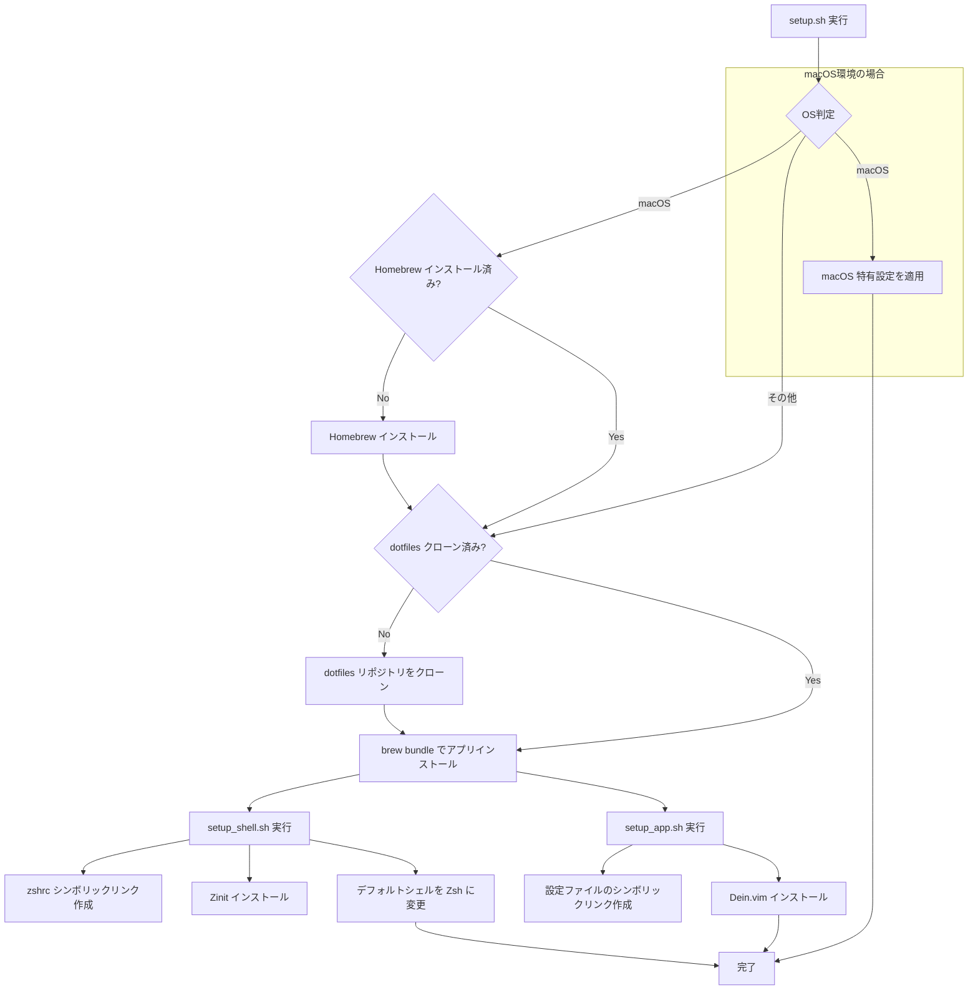
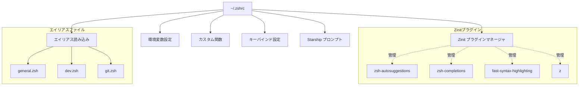
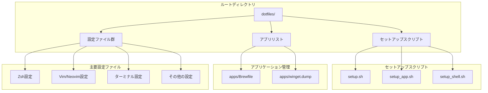
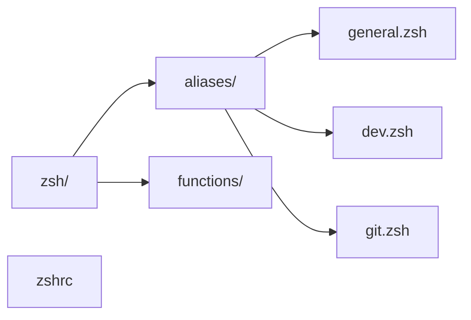
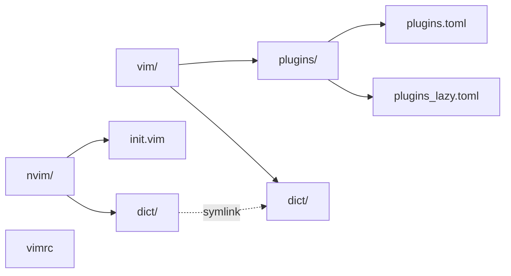
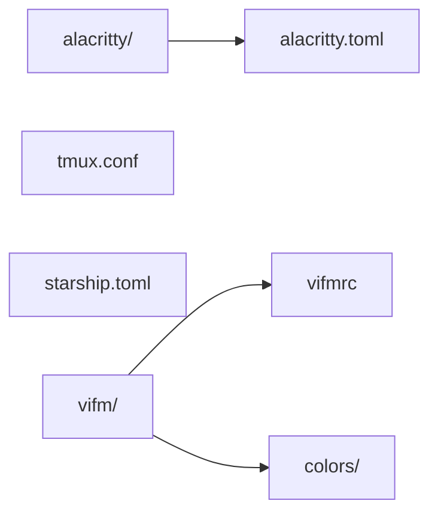

# ドットファイル解説

## はじめに

このドキュメントは、開発環境を統一し、効率化するために作成された個人の設定ファイル群（ドットファイル）について解説するものです。
これらの設定は GitHub リポジトリで管理されており、新しい環境でも迅速に同じ設定を再現することを目的としています。
主に Zsh、Vim/Neovim、Tmux などのツール設定を含んでいます。

## インストールとセットアップ

### インストールコマンド

以下のコマンドを実行することで、この dotfiles 環境を自動的にセットアップします。

```bash
/bin/zsh -c "$(curl -fsSL https://raw.githubusercontent.com/stakaya/dotfiles/master/setup.sh)"
```

### セットアップフロー

上記のコマンドを実行すると、`setup.sh` スクリプトが実行され、以下の処理が行われます。

1.  **Homebrew の確認とインストール**:
    *   macOS 環境で Homebrew がインストールされていない場合、自動的にインストールします。
2.  **dotfiles リポジトリのクローン**:
    *   `~/dotfiles` ディレクトリが存在しない場合、GitHub からリポジトリをクローンします。
3.  **各種アプリケーションのインストール**:
    *   `apps/Brewfile` に基づいて、Homebrew を使用して必要なアプリケーションやライブラリをインストールします (`brew bundle` コマンド)。
4.  **シェル設定 (`setup_shell.sh`)**:
    *   `$HOME/dotfiles/zshrc` へのシンボリックリンクを `$HOME/.zshrc` として作成します。
    *   Zsh プラグインマネージャである Zinit をインストールします。
    *   デフォルトシェルを Zsh に変更します。
5.  **アプリケーション設定 (`setup_app.sh`)**:
    *   各種設定ファイル・ディレクトリへのシンボリックリンクを作成します。
        *   ホームディレクトリ直下: `gvimrc`, `vimrc`, `ideavimrc`, `vim`, `vifm`, `tmux.conf`, `zsh`
        *   `~/.config` ディレクトリ以下: `nvim`, `vifm`, `alacritty`, `starship.toml`, `git`
    *   Vim プラグインマネージャである Dein.vim をインストールします。
    *   `vim/dict` を `nvim/dict` にシンボリックリンクします。
6.  **macOS 特有設定**:
    *   `defaults` コマンドを使用して、macOS の各種システム設定（キーリピート速度、Finder の設定、Dock の挙動など）を適用します。

セットアップ処理の流れを以下に図示します。



### シェル設定 (Zsh)

Zsh は高機能なシェルであり、この dotfiles 環境の主要なコンポーネントの一つです。設定は主に `~/.zshrc` (実体は `$HOME/dotfiles/zshrc` へのシンボリックリンク) と `~/dotfiles/zsh/` ディレクトリ内のファイルで行われます。



**主な設定内容:**

*   **Zinit プラグインマネージャ**:
    *   `zshrc` 内で Zinit が初期化され、プラグインの読み込みを管理します。
    *   主要なプラグイン:
        *   `zsh-users/zsh-autosuggestions`: コマンド入力中に履歴に基づいて候補を提示します。
        *   `zsh-users/zsh-completions`: Zsh の補完機能を強化します。
        *   `zdharma/fast-syntax-highlighting`: コマンドラインのシンタックスハイライトを高速に行います。
        *   `rupa/z`: 移動したディレクトリを記憶し、あいまいな入力で賢く移動できます (`z` コマンド)。
*   **環境変数**:
    *   `LANG`, `LC_CTYPE`: 文字エンコーディングを `ja_JP.UTF-8` に設定します。
    *   `PATH`: `~/.nodebrew/current/bin` や `/opt/homebrew/bin` などを追加します。
    *   `rbenv` の初期化も行われます。
*   **エイリアス**:
    *   `$HOME/dotfiles/zsh/aliases/` ディレクトリ内の `.zsh` ファイルが読み込まれます。
        *   `general.zsh`: 一般的なコマンドのエイリアス (例: `ls --color`, `weather`, `search` カスタム関数)。ファイル拡張子に基づいた `vi` でのオープンや `extract` 関数呼び出しのサフィックスエイリアスも定義されています。
        *   `dev.zsh`: 開発用ツール関連のエイリアス (例: `apkcheck`, `brewclean`, `indocker`, `tmux -u -2`)。
        *   `git.zsh`: Git 関連のエイリアス (例: `gitreset`)。
*   **カスタム関数**:
    *   `git_switch`: `fzf` を利用してブランチをインタラクティブに切り替えます。
    *   `git_fetch`: `fzf` を利用してリモートブランチをインタラクティブにフェッチします。
    *   `git_add`: `fzf` を利用して `git add` するファイルをインタラクティブに選択します。
    *   `space_widget`: スペースキーの挙動をカスタマイズし、特定の状況で `fzf-cd-widget` や `fzf-file-widget` を起動します。
    *   `extract`: 各種アーカイブファイルを適切に展開します。
*   **キーバインド**:
    *   Vim ライクなキーバインド (`bindkey -v`) を基本としつつ、多数のカスタムバインドが設定されています。
        *   `jj`: ノーマルモードへ移行 (vi-cmd-mode)。
        *   `;;`: 行末へ移動。
        *   `Ctrl+N`, `Ctrl+P`: 履歴検索。
        *   `ga`, `gs`, `gf`: それぞれ `git_add`, `git_switch`, `git_fetch` 関数を呼び出し。
        *   `kk`: `fzf-history-widget` を起動。
*   **Starship プロンプト**:
    *   モダンでカスタマイズ可能なプロンプトである Starship を初期化します (`eval "$(starship init zsh)"`)。設定は `~/dotfiles/starship.toml` (シンボリックリンク先は `~/.config/starship.toml`) で行われます。

**Fzf 連携**:
`zshrc` では `fzf` (コマンドラインファジーファインダー) との連携も強化されており、ファイル検索、コマンド履歴検索、Git 操作などで活用されています。`FZF_DEFAULT_COMMAND` や `FZF_CTRL_T_COMMAND` などの環境変数を設定し、プレビュー機能もカスタマイズしています。

**Alacritty と Tmux の自動セッション管理**:
Alacritty ターミナル内で Zsh がインタラクティブシェルとして起動され、かつ Tmux セッションが存在しない場合、既存の Tmux セッションにアタッチするか、新しいセッションを作成するかを `fzf` で選択する機能が組み込まれています。

### エディタ設定 (Vim/Neovim)

Vim および Neovim は、この dotfiles 環境で中心的な役割を果たすテキストエディタです。設定は主に以下のファイル群で行われます。

*   `$HOME/dotfiles/nvim/init.vim` (Neovim のメイン設定ファイル、`~/.config/nvim/init.vim` へシンボリックリンク)
*   `$HOME/dotfiles/vimrc` (Vim のメイン設定ファイル、`~/.vimrc` へシンボリックリンク)
*   `$HOME/dotfiles/vimrc.keymap` (キーマップ設定ファイル)
*   `$HOME/dotfiles/vim/plugins/` (Dein.vim によるプラグイン設定)
*   `$HOME/dotfiles/nvim/dict/` (辞書ファイルディレクトリ、`vim/dict` からシンボリックリンク)

**設定の概要:**

*   **Neovim (`nvim/init.vim`)**:
    *   Neovim の設定エントリポイントです。
    *   クリップボード設定 (`set clipboard=unnamed`) やインクリメンタルコマンドプレビュー (`set inccommand=split`) など基本的な設定を行います。
    *   環境（VSCode内、Windows、その他）に応じて、`$HOME/dotfiles/vimrc.keymap` や `$HOME/dotfiles/vimrc` (または `_vimrc` for Windows) を読み込みます。
    *   Python3 のホストプログラムパスを設定します。
*   **Vim (`vimrc`)**:
    *   (Neovim の設定からも読み込まれる) Vim の基本的な設定が含まれます。
    *   (このファイル自体の詳細はこのドキュメントでは省略しますが、プラグイン設定と合わせてカスタマイズの中心となります。)
*   **キーマップ (`vimrc.keymap`)**:
    *   VSCode 環境などで共有される可能性のあるキーマップが定義されています。 (内容は `vimrc.keymap` を参照)
*   **プラグイン管理 (Dein.vim)**:
    *   `setup_app.sh` により、Vim/Neovim のプラグインマネージャとして `Shougo/dein.vim` がインストールされます。
    *   プラグインのリストと設定は、TOML 形式のファイルで管理されています。
        *   `vim/plugins/plugins.toml`: 起動時に読み込まれるプラグインが定義されています。
            *   `blueshirts/darcula`: Darcula カラースキーム。
            *   `itchyny/lightline.vim`: 高機能なステータスライン。
            *   `kana/vim-fakeclip`: クリップボードサポート。
            *   `junegunn/fzf`, `junegunn/fzf.vim`: fzf との連携。多数のカスタムコマンドやキーマッピング (例: `<space>;` で `:Commands`, `<space>w` で `:Buffers`) が設定されています。
            *   `Shougo/unite.vim`, `Shougo/vimfiler`: ファイル操作や情報統合のためのインターフェース。
            *   `andymass/vim-matchup`: 対応する括弧などをハイライト・移動。
            *   `tomtom/tcomment_vim`: コードコメントアウト支援。
            *   `tpope/vim-abolish`: 単語の複数形・過去形などの一括置換。
            *   `tpope/vim-surround`: 括弧や引用符の簡単操作。
            *   `github/copilot.vim`: GitHub Copilot 連携。
        *   `vim/plugins/plugins_lazy.toml`: 遅延読み込みされるプラグインが定義されています。これらは特定のイベント、コマンド実行時、またはファイルタイプ検出時に読み込まれます。
            *   `tyru/eskk.vim`: SKK 日本語入力。辞書パスやマーカー、キーバインド (`<C-J>` でトグルなど) が設定されています。
            *   `koron/dicwin-vim`: 辞書参照。
            *   `editorconfig/editorconfig-vim`: `.editorconfig` ファイルに基づくコーディングスタイル適用。
            *   `tyru/open-browser.vim`: カーソル下の単語や選択範囲でブラウザ検索。
            *   `thinca/vim-qfreplace`: Quickfix リスト内の一括置換。
            *   Markdown サポート (`kannokanno/previm`, `plasticboy/vim-markdown`)。
            *   各種言語サポート (`typescript-vim`, `vim-jsx-typescript`, `vim-toml`, `kotlin-vim` など)。
            *   `mattn/emmet-vim`: HTML/CSS の高速コーディング。
            *   `mattn/gist-vim`: Gist 連携。
            *   `madox2/vim-ai`: OpenAI API を利用した AI コーディング支援。カスタム関数 (`GitCommitMessage`, `AICodeReview`) も定義。
            *   `shinchu/hz_ja.vim`: 日本語ヘルプ。
            *   LSP (Language Server Protocol) 関連 (`prabirshrestha/vim-lsp`, `mattn/vim-lsp-settings`, `mattn/vim-lsp-icons`): コード補完、定義ジャンプ、フォーマットなど。
            *   非同期補完 (`prabirshrestha/asyncomplete.vim`, `prabirshrestha/asyncomplete-lsp.vim`)。
*   **辞書ファイル (`nvim/dict/`)**:
    *   `setup_app.sh` によって `$HOME/dotfiles/vim/dict` が `$HOME/dotfiles/nvim/dict` にシンボリックリンクされます。
    *   ここには SKK 日本語入力で使用する辞書ファイル (`SKK-JISYO.L`, `SKK-JISYO.user` など) が格納されています。

この設定により、Vim/Neovim は強力な開発ツールとして機能し、日本語入力、ファジーファイン検索、LSP による高度なコーディング支援、AI 連携などが可能になっています。

### ターミナルマルチプレクサ (Tmux)

Tmux はターミナルマルチプレクサで、一つのターミナルウィンドウ内で複数のセッションやウィンドウ、ペインを管理できます。

*   **設定ファイル**: `$HOME/dotfiles/tmux.conf` (シンボリックリンク先は `~/.tmux.conf`)
*   **主な特徴**:
    *   `zshrc` 内のスクリプトにより、Alacritty ターミナルから起動する際に既存の Tmux セッションへのアタッチや新規作成を `fzf` で選択できます。
    *   `tmux -u -2` エイリアス (`zsh/aliases/dev.zsh`) により、UTF-8 および 256色表示をサポートする形で起動されることが多いです。
    *   具体的なキーバインドやステータスバーのカスタマイズは `tmux.conf` の内容に基づきます。(詳細は `tmux.conf` を参照)

### ターミナルエミュレータ (Alacritty)

Alacritty は GPU アクセラレーションを利用した高速なターミナルエミュレータです。

*   **設定ファイル**: `$HOME/dotfiles/alacritty/alacritty.toml` (シンボリックリンク先は `~/.config/alacritty/alacritty.toml`)
*   **主な特徴**:
    *   設定は TOML 形式で行われます。
    *   フォント、カラーテーマ、キーバインドなどがカスタマイズ可能です。(詳細は `alacritty.toml` を参照)

### Git 設定

Git の設定は、グローバルな無視ファイルと Zsh のエイリアス・関数によって補強されています。

*   **グローバル無視ファイル**: `$HOME/dotfiles/git/ignore` (シンボリックリンク先は `~/.config/git/ignore`)
    *   OS によって生成されるファイル (`.DS_Store` など) や一般的な一時ファイルが無視リストに含まれていると考えられます。
*   **Zsh エイリアス・関数**:
    *   `gitreset`: `git fetch --all && git reset --hard origin/main` (リモートの main ブランチに強制的にリセット)
    *   `git_switch`, `git_fetch`, `git_add` 関数: `fzf` を利用したインタラクティブな Git 操作を提供します (Zsh セクションで詳述)。

### ファイルマネージャ (Vifm)

Vifm は Vi ライクなキーバインドを持つコンソールベースのファイルマネージャです。

*   **設定ファイル**:
    *   `$HOME/dotfiles/vifm/vifmrc` (シンボリックリンク先は `~/.config/vifm/vifmrc`)
    *   `$HOME/dotfiles/vifm/colors/Default.vifm` (カラースキーム設定)
*   **主な特徴**:
    *   二画面ファイラであり、Vim のようなモーダル編集とキーバインドで操作できます。

### アプリケーション管理ファイル

*   **`apps/Brewfile`**:
    *   Homebrew Bundle 用のファイルで、`setup.sh` 内で `brew bundle` コマンドにより macOS 環境にインストールするアプリケーションやライブラリ、フォントなどをリストアップしています。
*   **`apps/winget.dump`**:
    *   Windows Package Manager (winget) の設定ダンプファイルと思われます。この dotfiles のセットアップスクリプト (`setup.sh`) は主に macOS/Linux を対象としていますが、Windows 環境でのパッケージ管理情報も含まれている可能性があります。

## ディレクトリ構造の概要

この `dotfiles` リポジトリの主要なディレクトリとその役割の概要を以下に示します。

### メインディレクトリ構造



### 詳細なディレクトリ構造

#### Zsh関連設定


#### Vim/Neovim関連設定


#### ターミナル関連設定


*   **`alacritty/`**: Alacritty ターミナルエミュレータの設定 (`alacritty.toml`)。
*   **`apps/`**: アプリケーションのリスト。
    *   `Brewfile`: Homebrew でインストールする macOS アプリケーションのリスト。
    *   `winget.dump`: Windows Package Manager (winget) の情報。
*   **`doc/`**: このドキュメント (`spec.ja.md`) が格納されています。
*   **`git/`**: Git 関連の設定。
    *   `ignore`: グローバルな `.gitignore` ファイル。
*   **`nvim/`**: Neovim の設定ディレクトリ。
    *   `init.vim`: Neovim のメイン設定ファイル。
    *   `dict/`: SKK 辞書ファイル (実体は `vim/dict` へのシンボリックリンク)。
*   **`vim/`**: Vim の設定ディレクトリ。
    *   `plugins/`: Dein.vim によるプラグイン設定 (`plugins.toml`, `plugins_lazy.toml`)。
    *   `dict/`: SKK 辞書ファイル。
*   **`vifm/`**: Vifm ファイルマネージャの設定。
    *   `vifmrc`: Vifm の設定ファイル。
    *   `colors/`: カラースキーム。
*   **`zsh/`**: Zsh の追加設定ディレクトリ。
    *   `aliases/`: エイリアス定義ファイル群 (`dev.zsh`, `general.zsh`, `git.zsh`)。
    *   `functions/`: (現在は `.gitkeep` のみですが) カスタム関数を配置可能。
*   **ルートレベルの主要ファイル**:
    *   `setup.sh`: メインのセットアップスクリプト。
    *   `setup_app.sh`: アプリケーション関連のセットアップスクリプト。
    *   `setup_shell.sh`: シェル関連のセットアップスクリプト。
    *   `starship.toml`: Starship プロンプトの設定ファイル。
    *   `tmux.conf`: Tmux の設定ファイル。
    *   `vimrc`: Vim のメイン設定ファイル (Neovim からも参照)。
    *   `zshrc`: Zsh のメイン設定ファイル。
    *   `readme.md`: リポジトリの簡単な説明とインストール方法。
    *   その他: `.editorconfig`, `.gitignore`, `gvimrc`, `ideavimrc` など。

## カスタマイズ

この dotfiles は個人の設定集ですが、フォークして自分の好みに合わせてカスタマイズすることが可能です。

**主なカスタマイズ方法:**

1.  **リポジトリのフォーク**:
    *   まず、この GitHub リポジトリ ([https://github.com/stakaya/dotfiles](https://github.com/stakaya/dotfiles) など、実際のURLを想定) を自分のアカウントにフォークします。
2.  **設定ファイルの編集**:
    *   フォークしたリポジトリ内の各種設定ファイル (`.zshrc`, `vimrc`, `tmux.conf`, 各プラグイン設定など) を直接編集します。
    *   エイリアスを追加・変更する場合は `zsh/aliases/` 内のファイルを編集します。
    *   インストールするアプリケーションを変更する場合は `apps/Brewfile` (macOS) を編集します。
3.  **変更の適用**:
    *   ローカルにクローンした自分のリポジトリで変更を行い、コミット・プッシュします。
    *   新しい環境でセットアップする場合は、`setup.sh` 内のクローンURLを自分のリポジトリのURLに変更して実行します。
    *   既存の環境で設定を更新する場合、手動でシンボリックリンクを更新するか、`setup_app.sh` や `setup_shell.sh` の関連部分を再実行する必要があるかもしれません。

**注意点**:

*   上流の dotfiles リポジトリに追従したい場合は、定期的に変更を取り込む（マージまたはリベースする）ことを検討してください。
*   設定ファイル間の依存関係（例: `nvim/init.vim` が `vimrc` を読み込むなど）を理解しておくと、カスタマイズが容易になります。
